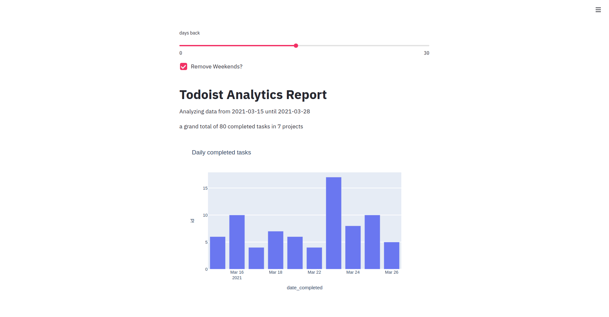

# Todoist Analytics

<b>
If you use Todoist for daily, weekly, monthly or yearly planning you should try this tool.
</b>

This is how the current version of the tool looks like.

The main goal for this tool is to help you keep track and create analytics based on your data from todoist.

## TODO TEMPLATES
If you're not sure about how to properly use todoist for task planning check out this template (TO BE DONE)

## Part 1: Getting the data -> Done
Create an application that calls the Todoist API and gets all done and tbd tasks from an user

## Part 2: Weekly review tab (Current)
From the gattered data create a dashboard with info from the user's last week plus some insights

## Part 3: Monthly review tab
Personalized insights and monthly reviews (:

# Usage

## Get your API Key
Go to your Todoist settings into the integrations tab, at the bottom you'll find your API key, copy it.

## Create your credentials.py file

`$ make credentials`

and if your credential file doesn't exist, you will be prompted to input your token.

## Run the app

`$ make app`
